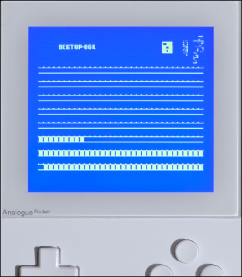
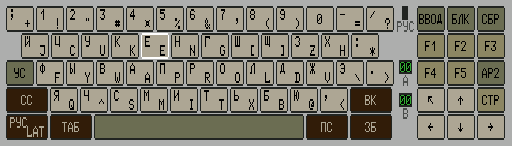

# Vector-06C for the Analogue Pocket

This is a [Vector-06C](https://en.wikipedia.org/wiki/Vector-06C) core for [Analogue Pocket](https://www.analogue.co/pocket), directly ported from [Vector-06C_MiSTer](https://github.com/MiSTer-devel/Vector-06C_MiSTer) (with LLM assistance).

### Features

- Fully functional Vector-06C with precise timings
- 3MHz(original) and 6MHz(turbo) speeds for CPU.
- 320KB RAM (including 256KB of Quasi-disk)
- Following file formats are supported: 
    - ROM: simple tape backup (loading from 0x100 address)
    - FDD: floppy dump (read/write)
    - EDD: Quasi-disk dump
- All known joystick connections: 2xP, 1xPU(USPID), 2xS
- Specially developed i8253 module for better compatibility.
- AY8910/YM2149 sound
- Optional loadable BOOT ROM (up to 32KB)
- Z80 CPU (experimental)
- Virtual Keyboard (new for Pocket)

### Installation

Download and unzip the .zip from the releases to the root of your Pocket's SD card.

### Controls:

This core can be used in handheld mode, or with an external USB keyboard via
the dock.

For the external keyboard, notable mappings are:

| Key   | Action                                  |
| ----- | --------------------------------------- |
| F11   | Reset/Return to boot ROM loader (ВВОД)  |
| F12   | Restart/Launch loaded program (БЛК+СБР) |
| ALT   | Rus/Lat                                 |
| ESC   | АР2                                     |
| CTRL  | УС                                      |
| SHIFT | СС                                      |

Default controller mappings:

| Button | Configurable | Default Action                      |
| ------ | ------------ | ----------------------------------- |
| L1     | No           | Open/close virtual keyboard         |
| R1     | Yes          | Enter (ВК)                          |
| Select | Yes          | RUS/LAT (РУС/LAT)                   |
| Start  | No           | Restart/Launch program in RAM (СБР) |
| A      | Yes          | Space                               |
| B      | Yes          | Alt (ПС)                            |
| X      | Yes          | Shift (СС)                          |
| Y      | Yes          | Tab (ТАБ)                           |

### Menu options

The pocket menu provides the following items:

| Item                 | Description |
| -------------------- | ----------- |
| Load ROM/COM         | Load ROM/COM images (0x100 address) |
| Load C00             | Load C00/r0m images (0x000 address) |
| Load Floppy Disk A/B | Load floppy image - once loaded, launch with the Start button (СБР) |
| Load EDD (Ramdisk)   | Load Quasi-disk dump |
| Gamepad Mode         | Choose between emulated keyboard or joystick |
| CPU Type/Speed       | i8080/Z80 at 3MHz/6MHz (i8080/3MHz is the standard Vector-06C CPU) |
| Map A/B/X/Y/Select   | Remap buttons to a selection of keys in keyboard emulation mode |
| Stereo Mix           | |
| Reset                | Same as the БЛК+ВВОД key on a real Vector-06C |
| Cold Reboot          | Clear RAM, eject floppies, reset |

### Virtual Keyboard

Since the Vector-06c is a personal computer, a keyboard is very useful things
like entering commands MicroDOS, writing programs in basic or just navigating
menus in games. For this, in addition to supporting USB keyboards via the
dock, the core also provides a virtual keyboard.

| Button | Action                        |
| ------ | ----------------------------- |
| L1     | Open/close keyboard           |
| R1     | Toggle position (top/bottom)  |
| A      | Momentary press               |
| B      | Close keyboard                |
| X      | Latching/sticky press         |
| Y      | Release all latched keys      |

### Notes:
- ROM files are started automatically after loading.
- Some applications on disks require Quasi-disk to be formatted (and refuse to work if not). In this case, you need to hold **CTRL (УС)** during boot to automatically format Quasi-disk at MicroDOS startup.

### Acknowledgements:
- [MiSTer Vector-06C](https://github.com/MiSTer-devel/Vector-06C_MiSTer) core by [@sorgelig](https://github.com/sorgelig)
- [Precise K580VM80A (i8080) model](https://github.com/1801BM1/vm80a) by [@1801BM1](https://github.com/1801BM1)
- Peripheral modules by Dmitry Tselikov ([Bashkiria-2M](http://bashkiria-2m.narod.ru/))
- [vector06cc](https://github.com/svofski/vector06cc), [vector06sdl](https://github.com/svofski/vector06sdl) and general guidance by [@svofski](https://github.com/svofski)
- [OpenFPGA_ZX-Spectrum](https://github.com/dave18/OpenFPGA_ZX-Spectrum) by [@dave18](https://github.com/dave18) and [MyC64](https://github.com/markus-zzz/myc64-pocket) by [@markus-zzz](https://github.com/markus-zzz) for general reference, such as softcpu integration
- Various OpenFPGA reference projects [@agg23](https://github.com/agg23/)
